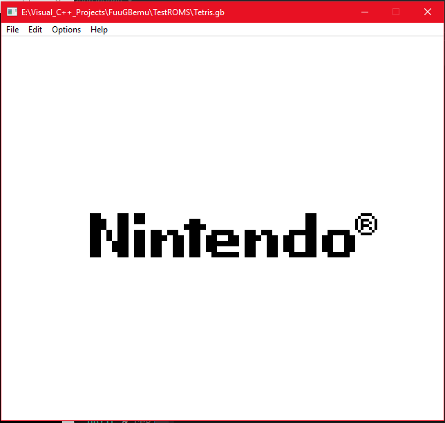
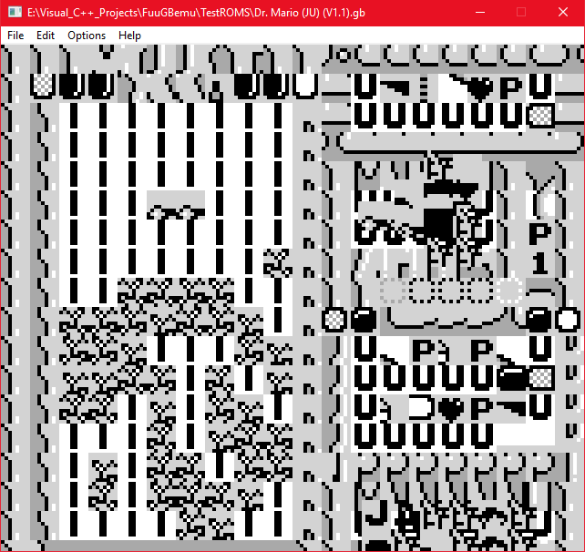

# FuuGBemu
Cross platform C/C++ GameBoy emulator using SDL2 framework.

Algorithm for the PPU and Memory Management are taken from http://www.codeslinger.co.uk/pages/projects/gameboy.html

All credit goes to codeslinger!

Early Alpha Development

Build Script System provided by Premake5 : https://github.com/premake/premake-core

## How to build:

    1.  Clone Repository into arbitrary directory.
    2.  Open the command line or Terminal from the DIRECTORY of the CLONED repository.
    
    MAC OS X
    **Only supports building with Xcode.
        3_1. From the Terminal, enter "premake5 xcode4" (or "./premake5 xcode4" if the command is not recognized).
        3_2. Open the generated .xcodeproj file.
        3_3. Build the project in Xcode.

    WINDOWS:
    **Only supports building with VS 2013, 2015, 2017 and 2019.
        3_4. From the Command Line, enter "premake5 vs20xx". (where xx = 13, 15, 17 or 19)
        3_5. Open the generated .sln file.
        3_6. Build the project in Visual Studio.
        
        **NOTE: Clean solution prior to rebuilding, or else some copied dll's will not be updated to
			the new build version. (Only applicable for Windows)

## Emulation Accuracy Testing

	The following are tests performed on the emulator to verify its accuracy.
	All tests used are validated test roms that have been tested on real hardware.
	Blargg's test rom suite: https://github.com/retrio/gb-test-roms
	Gekkio's test rom repo: https://github.com/Gekkio/mooneye-gb/tree/master/tests

### Blargg's CPU Instruction Tests
| Test 		| Fail/Pass |
|------			|-------|
|01-special		| Fail	|
|02-interrupts		| Pass	|
|03-op sp,hl		| Fail	|
|04-op r,imm		| Fail	|
|05-op rp		| Fail	|
|06-ld r,r		| Fail	|
|07-jr,jp,call,ret,rst	| Fail	|
|08-misc instrs		| inf. loop? |
|09-op r,r		| Fail	|
|10-bit ops		| Fail	|
|11-op a,(hl)		| Fail	|

### Milestones:

	Emulator is able to successfully get past the bootrom:

	Emulator is able to boot into first game (although very buggy) (Dr. Mario)

### Current WIP:
	Trying to get all of Blargg's Cpu tests to pass
