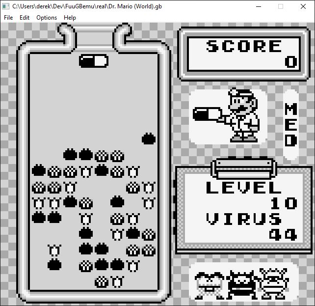

# FuuGBemu
    

C/C++ DMG GameBoy emulator using SDL2 Libraries.

Algorithm for the PPU and Memory Management are taken from http://www.codeslinger.co.uk/pages/projects/gameboy.html

All credit goes to codeslinger!

Early Alpha Development

  

## How To Build
    MAC OS X
        1.  git clone --recursive https://github.com/DerekBoucher/FuuGBemu.git && cd FuuGBemu
        2.  make debug
        3.  make clean (if you wish to delete the build folder)
    
    WINDOWS
        1. Strongly recommend installing chocolatey package manager: https://chocolatey.org/install
            1.1 once installed issue the following commands from the command line (make sure to run cmd as ADMINISTRATOR):
                choco install make
                choco install mingw
        2.  git clone --recursive https://github.com/DerekBoucher/FuuGBemu.git && cd FuuGBemu
        3.  make debug
        4.  make clean (if you wish to delete the build folder)

    LINUX
        1.  Not Supported yet

## Emulation Accuracy Testing

	The following are tests performed on the emulator to verify its accuracy.
	All tests used are validated test roms that have been tested on real hardware.
	Blargg's test rom suite: https://github.com/retrio/gb-test-roms

## Blargg's CPU Instruction Tests
| Test 		| Fail/Pass |
|------			|-------|
|01-special		| Fail	|
|02-interrupts		| Pass	|
|03-op sp,hl		| Fail	|
|04-op r,imm		| Fail	|
|05-op rp		| Fail	|
|06-ld r,r		| Fail	|
|07-jr,jp,call,ret,rst	| Fail	|
|08-misc instrs		| inf. loop? |
|09-op r,r		| Fail	|
|10-bit ops		| Fail	|
|11-op a,(hl)		| Fail	|