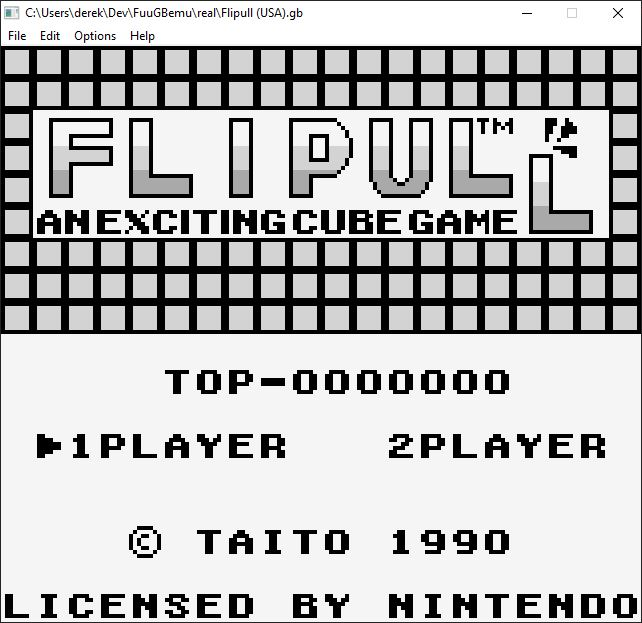
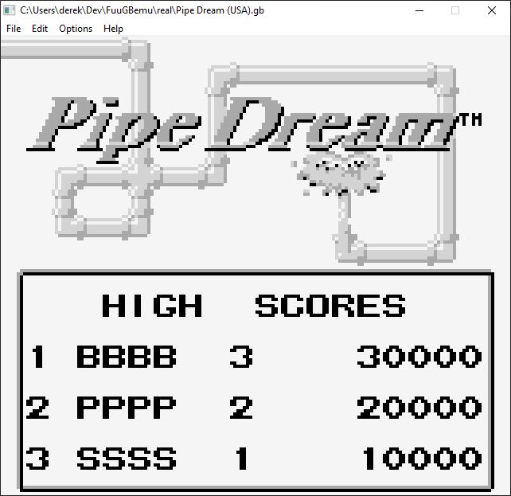

# FuuGBemu
        

C/C++ DMG GameBoy emulator using SDL2 Libraries.

Algorithm for the PPU and Memory Management are taken from http://www.codeslinger.co.uk/pages/projects/gameboy.html

All credit goes to codeslinger!

Early Alpha Development

  

## How To Build
    MAC OS X
        1.  git clone --recursive https://github.com/DerekBoucher/FuuGBemu.git && cd FuuGBemu
        2.  make debug
        3.  make clean (if you wish to delete the build folder)
    
    WINDOWS
        1. Strongly recommend installing chocolatey package manager: https://chocolatey.org/install
            1.1 once installed issue the following commands from the command line (make sure to run cmd as ADMINISTRATOR):
                choco install make
                choco install mingw
        2.  git clone --recursive https://github.com/DerekBoucher/FuuGBemu.git && cd FuuGBemu
        3.  make debug
        4.  make clean (if you wish to delete the build folder)

    LINUX
        1.  Make sure you have the SDL2 development libraries installed. You can get them via your distro's package manager.
            For Ubuntu:
                sudo apt-get install libsdl2-dev
        2.  make debug
        3.  There is no support for open file dialog box yet, therefore to launch a rom you need to run the built binary with the path of the gb rom as an argument:
            Example:
                ./FuuGBemu gb-test-roms/cpu_instrs/cpu_instrs.gb
        4. You might need to make the binary executable:
            Run:
                chmod -x FuuGBemu

## Emulation Accuracy Testing

	The following are tests performed on the emulator to verify its accuracy.
	All tests used are validated test roms that have been tested on real hardware.
	Blargg's test rom suite: https://github.com/retrio/gb-test-roms

## Blargg's CPU Instruction Tests
| Test 		| Fail/Pass |
|------			|-------|
|01-special		| :heavy_check_mark:	|
|02-interrupts		| :heavy_check_mark:	|
|03-op sp,hl		| :heavy_check_mark:	|
|04-op r,imm		| :heavy_check_mark:	|
|05-op rp		| :heavy_check_mark:	|
|06-ld r,r		| :heavy_check_mark:	|
|07-jr,jp,call,ret,rst	| :heavy_check_mark:	|
|08-misc instrs		| :heavy_check_mark: |
|09-op r,r		| :heavy_check_mark:	|
|10-bit ops		| :heavy_check_mark:	|
|11-op a,(hl)		| :heavy_check_mark:	|